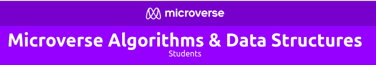

# CodeChallenges

This repository tracks all my code challenge solutions from the Microverse "Algorithm and Data Structure" Curriculum. All the solutions were written in Ruby language.

That Curriculum Contains Challenges from 3 platforms.

- [Hackerrank:](https://www.hackerrank.com/)
- [Repl.it](https://repl.it/)
- [LeetCode](https://leetcode.com/)

This part of the Microverse program has been designed with the following goals in mind:

- To make sure that I learn key concepts of Algorithms & Data Structures necessary to use during job interviews.
- To make sure that I work weekly on training algorithmic thinking that is necessary for a good programmer to have.
- To make sure that I practice the skills necessary for presenting your thought process and knowledge of algorithms & data structures in a live meeting
- To make sure that I practice giving feedback to others in real time.

## Author

👤 **Marilena Roque**

- Github: [MarilenaRoque](https://github.com/MarilenaRoque)
- Twitter: [@MariRoq88285995](https://twitter.com/MariRoq88285995)
- Linkedin: [roquemarilena](https://www.linkedin.com/in/roquemarilena/)

## 🤝 Contributing
Please, feel free to check my code and open an issue if you have a tip, advice or any feeback: [issues page](issues/).
